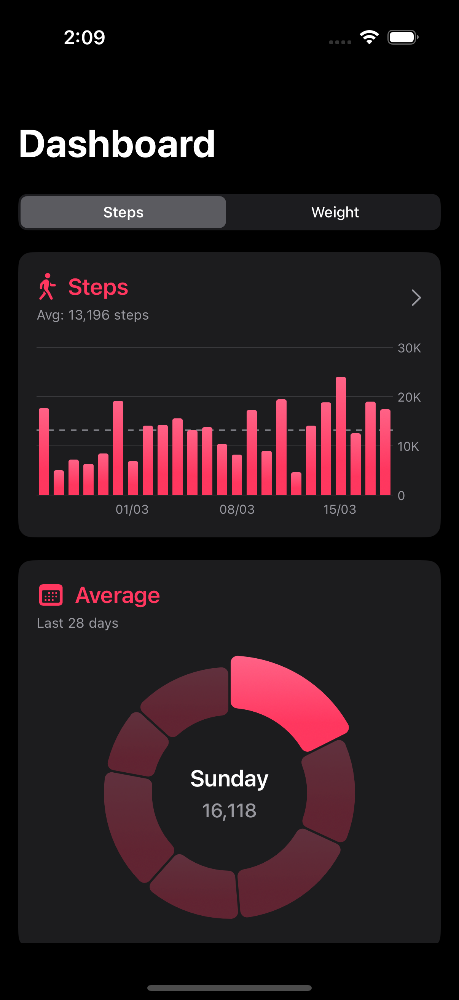
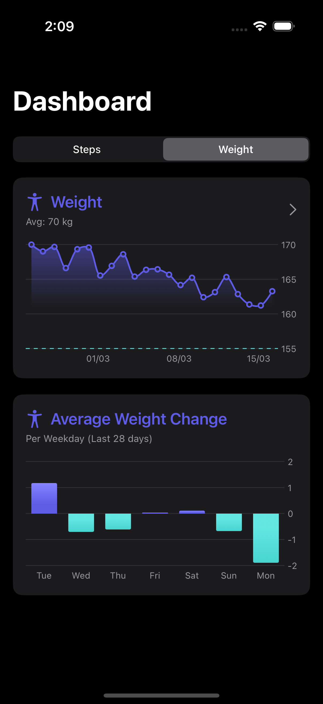
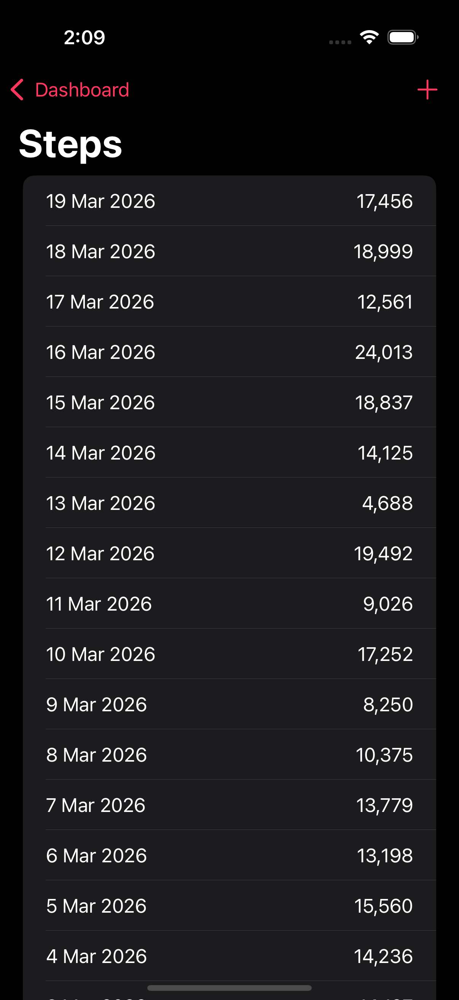
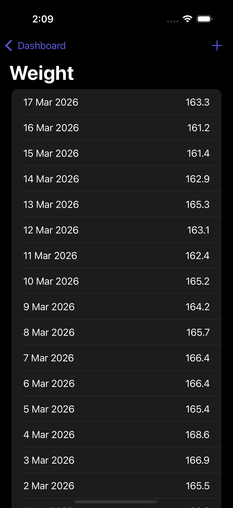

#  StepWise (Step Tracker)

StepWise is a sleek and comprehensive iOS application that integrates directly with Apple's **HealthKit** framework. It beautifully visualizes the user's daily step counts and body weight fluctuations over time. With a custom dashboard built using **Swift Charts**, users can effortlessly monitor their health metrics and trends.

## Features
- **HealthKit Integration:** Securely requests and reads step count and body mass data directly from the user's Health app.
- **Interactive Dashboards:** Switch between different health metrics (Steps, Weight) using intuitive segmented controls.
- **Data Visualization (Swift Charts):**
  - **Step Data:** View 28-day step history through Interactive Bar Charts.
  - **Step Averages:** Understand weekly step distribution through Pie Charts.
  - **Weight Trends:** Detailed Line Charts mapping weight changes over the previous 4 weeks.
  - **Daily Weight Differences:** Bar Charts detailing day-to-day weight fluctuations.
- **Alerts & Permissions:** Graceful handling of HealthKit authorization, permissions priming, and data unavailability errors.

- ## Screenshots

<table align="center">
  <tr>
    <td align="center">
       
      <b>Step Screen</b>
    </td>
    <td align="center">
       
      <b>Weight Screen</b>
    </td>
  </tr>
  <tr>
    <td align="center">
       
      <b>Step Data Screen</b>
    </td>
    <td align="center">
       
      <b>Weight Data Screen</b>
    </td>
  </tr>
</table>

## Technologies Used
- **SwiftUI:** For an elegant and fluid user interface.
- **HealthKit:** Seamless integration with iOS's native health data repository.
- **Swift Charts:** High-performance, customizable chart components rendering complex data sets with ease.
- **Observation Framework:** Modern `@Observable` for performant data binding.
- **Swift Concurrency:** Heavy use of `async/await` and `Task` groups (e.g., `async let`) for parallel HealthKit queries.

## App Structure
The app is organized focusing on modularity and clear separation of concerns:
- **Managers:** `HealthKitManager` acts as the single source of truth for interacting with the `HKHealthStore`, running complex statistics queries (`HKStatisticsCollectionQueryDescriptor`), and transforming data into `HealthMetric` structs.
- **Screens:** Includes `DashboardView` as the main hub, alongside `HealthDataListView` and `HealthKitPermissionPrimingView`.
- **Charts:** Specialized and reusable chart views (`StepBarChart`, `StepPieChart`, `WeightLineChart`, `WeightDiffBarChart`).
- **Utilities:** Contains extensions and robust error handling logic.

## Requirements
- iOS 17.0+
- Xcode 15.0+
- Swift 5.9+
